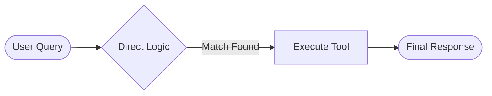
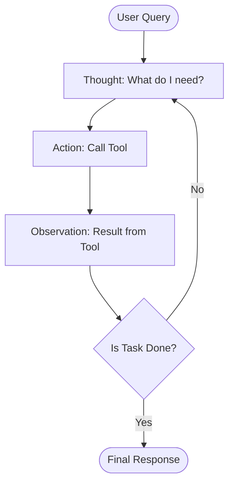
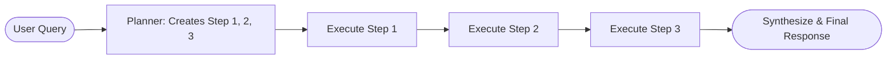
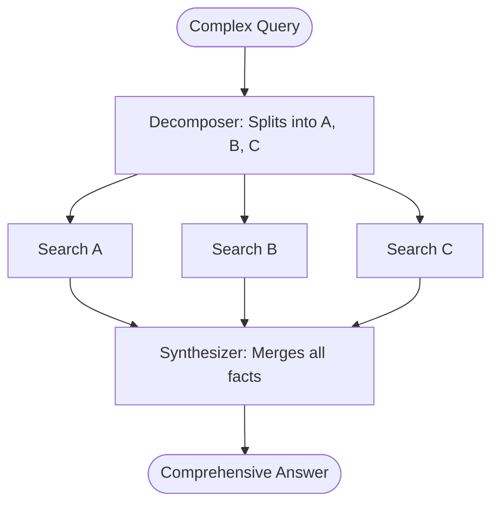
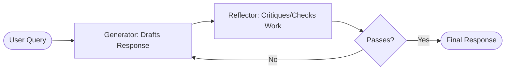

# Chapter 5: Orchestration

## Overview of Orchestration

**Definition:**  

Orchestration involves deciding which tools to call and requires constructing the right context for each model invocation. Simple tasks may require only a single tool, while complex workflows involve careful planning, memory retrieval, dynamic context assembly . 

**Goal:**  
Build agents capable of handling realistic, multistep tasks efficiently.

---

## Agent Types

Understanding different agent types is crucial for effective orchestration. Each agent type reflects a unique method of reasoning, planning, and acting, which determines how tasks are structured and carried out. The choice of agent type directly influences your system’s performance, cost, and capabilities.

---

### Reflex Agents

Reflex agents implement a direct mapping from input to action. Simple reflex agents follow "if-condition, then-action" rules. Reflex agents deliver responses with minimal latency and predictable performance. 

  
**Use Cases:**  
Keyword routing, single-step lookups, basic automations.



---

### ReAct Agents

ReAct agents interleave Reasoning and Action in an iterative loop: the model generates a thought, selects and invokes a tool, observes the result, and repeats as needed.

**Variations:**

- **ZERO_SHOT_REACT_DESCRIPTION:** Prompt-based reasoning without example traces  
- **CHAT_ZERO_SHOT_REACT_DESCRIPTION:** Incorporates conversational history  

**Use Cases:**  
Dynamic data analysis, multisource aggregation, troubleshooting.

React agents looped structure provides transparency that airds debugging and auditability. 




**Example** 

``` python

from langchain.agents import create_react_agent
from langchain.tools import tool
from langchain.llms import OpenAI

# Define a simple calculator tool
@tool
def calculator(expression: str) -> str:
    try:
        result = eval(expression)
        return f"Result: {result}"
    except Exception:
        return "Invalid expression."

# Define the LLM and tools
llm = OpenAI(model="text-davinci-003", temperature=0)
tools = [calculator]

# Create a Zero-Shot ReAct Agent
agent = create_react_agent(llm=llm, tools=tools, verbose=True)

```


---

### Planner-Executor Agents

Planner-executor agents split a task into two distinct phases: planning, where the model generates a multistep plan; and execution, where each planned step is carried out via tool calls. 


Because the plan is explicit, debugging and monitoring become straightforward—you can inspect the generated plan, track which step failed, and replan if needed. This approach has multiple advantages - clear decomposition, debuggability, cost efficiency. 


**Use Cases:**  
Complex, multistep processes.



``` python 
from langchain.agents import create_react_agent, AgentExecutor
from langchain.chains.base import Chain
from langchain_openai import ChatOpenAI
from langchain_experimental.plan_and_execute import load_chat_planner, load_agent_executor, PlanAndExecute

llm = ChatOpenAI(temperature=0, streaming=True)
planner = load_chat_planner(llm)
executor = load_agent_executor(llm, verbose=True)
agent_executor = PlanAndExecute(planner=planner, executor=executor, verbose=True)
```

---

### Query-Decomposition Agents

Query-decomposition agents tackle a complex question by iteratively breaking it into subquestions, invoking search or other tools for each, and then synthesizing a final answer. 

 

**Example:**  

**Ask:** “Who lived longer, X or Y?”  
**Self-ask:** “What’s X’s lifespan?” → search tool  

**Use Cases:**  
Research, fact-based Q&A.


This approach excels when external knowledge retrieval is needed, ensuring each fact is grounded in tool output before composing the final response.



---

### Reflection Agents

Reflection and metareasoning agents extend the ReAct paradigm by interleaving thought and action while also reviewing previous steps to identify and correct errors before moving forward.

Reflection prompts guide the model to review its reasoning, fix errors, and strengthen useful strategies, creating a human-style self-assessment loop for complex tasks.

With a reflection step after every action, agents catch unexpected tool outputs early and can replan or undo steps before making irreversible changes. This added metareasoning slows execution, but for accuracy-critical tasks, it offers strong protection against cascading errors and keeps the agent aligned with its goals.


**Use Cases:**  
High-stakes workflows (e.g., medical diagnosis, financial transactions).




**Example**

``` python 

from langchain import LangChain
from langchain.agents import Tool

# Define the generator agent
generator = Tool(name="generator", func=lambda x: "This is a sample LinkedIn post")

# Define the reflector agent
reflector = Tool(name="reflector", func=lambda x: "This is a sample critique and feedback")

# Create a LangChain instance
chain = LangChain([generator, reflector])

# Execute the chain and produce a final result
result = chain({"input": "Write a LinkedIn post about completing day one of filming my AI agent course"})
print(result)

```

---

### Deep Research Agents

**Functionality:**  
Handle open-ended, complex investigations.

**Process:**
- Plan research agenda  
- Decompose into queries  
- Invoke tools  
- Synthesize insights  

**Strengths:**
- Handles high-complexity investigations  
- Adaptive to new evidence  
- Transparent methodology  

**Weaknesses:**
- High compute costs and latency  
- Fragility due to reliance on data sources  

**Use Cases:**  
Academic literature surveys, technical due diligence, competitive intelligence.

---

### Summary of Agent Architecture types (Table 5-1)

| Agent Type           | Strength                                | Weakness                                | Best Use Case                       |
|----------------------|-------------------------------------------|-------------------------------------------|--------------------------------------|
| **Reflex**           | Millisecond responses                     | No multistep reasoning                    | Keyword routing, simple lookups      |
| **ReAct**            | Flexible, on-the-fly adaptation           | Higher latency and cost                   | Exploratory workflows, troubleshooting |
| **Planner-Executor** | Clear task breakdown                      | Planning overhead                         | Complex, multistep processes         |
| **Query-Decomposition** | Grounded retrieval accuracy            | Multiple tool calls                       | Research, fact-based Q&A             |
| **Reflection**       | Early error detection                     | Added compute and latency                 | High-stakes, safety-critical tasks   |
| **Deep Research**    | Manages multistage investigations         | Very high compute costs and latency       | Long-form literature reviews         |

---


## Tool Selection

Effective tool selection is foundational for orchestration. Different strategies offer distinct advantages and trade-offs.

---

### Table of Tool Selection Strategies

| Technique                        | Pros                            | Cons                              |
|----------------------------------|---------------------------------|-----------------------------------|
| **Standard Tool Selection**       | Simple to implement             | Scales poorly with many tools     |
| **Semantic Tool Selection**       | Scalable, low-latency execution | Lower selection accuracy          |
| **Hierarchical Tool Selection**   | Highly scalable                 | Slower due to multiple calls      |

---

### Standard Tool Selection

The simplest approach for tool selection is standard tool selection. Tool definitions are provided to a foundation model, which selects the most appropriate tool for the task. This approach is easier to implement and requires no additional training or hierarchical structure.

The main drawback of this approach is additional latency due to an extra foundation model call. It can benefit from in-context learning, where few-shot examples are provided in the prompt.

#### Best Practices

- Use concise, descriptive tool names  
- Provide one-sentence summaries of each tool’s purpose  
- Include example invocations to clarify expected inputs and outputs  
- Enforce input constraints to reduce ambiguity  

---

### Semantic Tool Selection

Another approach uses semantic representations to index all tools and semantic search to retrieve the most relevant ones. This reduces the number of tools to choose from and then relies on a foundation model to select the correct tool.

Each tool definition and description is represented using an encoder-only model such as OpenAI’s Ada model, BERT, or Cohere embedding models. These representations are indexed into a lightweight vector database. At runtime, the current context is embedded using the same embedding model, and the top-matching tools are retrieved. These tools are then passed to the foundation model, which can invoke the appropriate tool.

#### Advantages

- Scales well to large tool catalogs  
- Low-latency retrieval using vector search  
- Decouples tool selection from prompt length limits  

#### Limitations

- May select semantically similar but functionally incorrect tools  
- Often benefits from a secondary validation or ranking step  

---

### Hierarchical Tool Selection

Hierarchical tool selection can be used when many tools are similar and improved selection accuracy is required. In this pattern, tools are organized into groups, each with its own description. Tool selection first identifies the appropriate group and then performs a secondary search among the tools within that group.

While this approach is slower and more expensive to parallelize, it reduces the overall complexity of selection by breaking it into two smaller tasks. This type of tool selection is not recommended unless you have a large number of tools.

#### Advantages

- Highly scalable for large tool ecosystems  
- Improves accuracy by narrowing the decision space  

#### Limitations

- Increased latency due to multiple selection steps  
- More complex system design and orchestration logic  

---

## Tool Execution

Parameterization is the process of defining and setting parameters to guide the execution of a foundation model. This process is crucial, as it determines how the model interprets the task and tailors its behavior to meet specific requirements.

The current state of the agent, including its progress, is included as context in the prompt window, and the foundation model is instructed to fill in the required parameters. Additional context, such as the current time and the user’s location, can be injected into the prompt window to provide further guidance.

Once the parameters are set, the tool execution phase begins. Some tools can be executed locally, while others are executed remotely via APIs.


---

## Tool Topologies

Tool topology defines how many tools are executed and how their outputs are combined.

---

### Single Tool Execution

In this case planning consists of choosing the most appropriate tool to address the task. Once the tool is identified it must be parametrized based on the tool defnition. The tool is then executed and output is used as an input while composing the final answer for the user. 

### Parallel Tool Execution

In some cases it might be worth taking multiple actions on the input. If your toolset includes tools that access multiple sources of data then it is necessary to make multiple calls to fetch data from all the sources. 

This pattern enables agents to efficiently gather all the information from multiple sources in single step. By integrating the responses form each tool agent can provide richer and more informed outputs. 

### Chains 

Chains refer to sequence of actions that can be executed on after the other, with each action depending on the execution of previous one. Planning chains involves determining the order in which actions should be performed to achive a similar goal. Chains are common in tasks that involve step by step process or linear workflows. 


Planning of chains requires careful onsideration of dependencies between the actions. It is recommended to set the maximum length to chains to avoid error propagation. As long as task is not expected to fan out to multiple branches chains provides an excellent tradeoff between adding planning for multple tools with dependenceis and keeping the complexity low 


### Graph 

Each node in the graph represents a discrete tool invocation while edges declare the exact conditions under which the agent may transition between steps. By consolidating the respones from multiples branches into single downstream node you can stich answers from seperate handlers to unified one. 

Graph execution typically involves more foundation model calls then chains so its crucial to cap depth and branching factor. In addition cycles, unreachable nodes or conflicting state merges are the new types of errors that must be managed with rigorous validation and testing.  


## Context Engineering 

Context engineering is the practice of assembling the right information an AI agent needs to complete a task. Unlike prompt engineering, it focuses on selecting, structuring, and timing inputs such as user messages, system instructions, retrieved knowledge, and workflow state so the model can act efficiently and accurately.

It is essential for agent workflows because it connects planning with execution. By prioritizing relevant information, structuring it clearly, and updating it as tasks progress, context engineering helps agents stay coherent, use tools correctly, and perform reliably as tasks become more complex.

---


