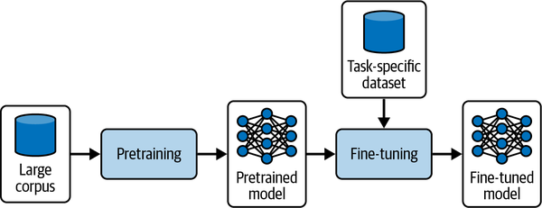
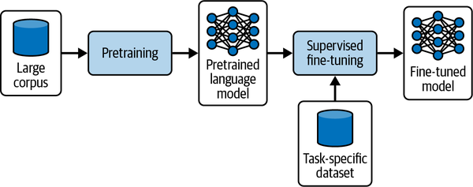
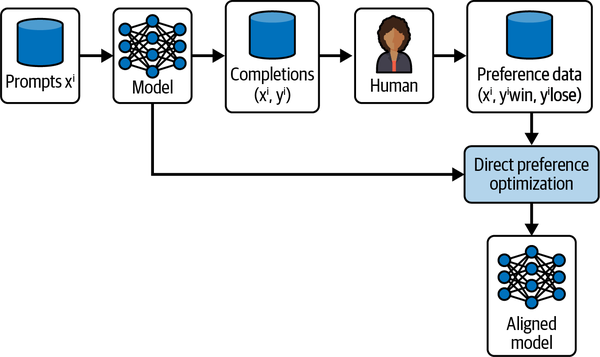
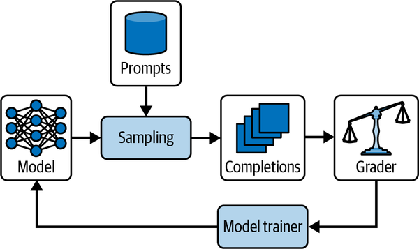

# Chapter 7. Learning in Agentic Systems

Adding the capability to learn and improve over time is a useful addition but not necessary while designing agents. By learning, we mean improving the performance of agentic systems through interaction with the environment.

Non-parametric learning refers to techniques that change and improve performance automatically without altering the model's weights. Parametric learning refers to techniques in which we specifically train or fine-tune the parameters of the foundation model.

## Non-parametric Learning

### Non-parametric Exemplar Learning

As the agent performs its task, it is provided with a measure of quality, and these examples are used to improve its performance. These examples are used as few-shot examples for in-context learning. If we have more examples, performance improvement eventually comes with an additional cost and latency.

Not all examples might be useful for all inputs. A common way to address this is to dynamically select the most relevant examples and add them to the context. This typically involves building a memory bank where details of each interaction, like context, actions, outcomes, or any feedback received, are stored. This database acts more like a human memory where past experiences shape understanding and guide future actions.

The agent uses past cases to solve new problems. Each case includes a problem, the solution used, and the result. When a new situation arises, the agent finds similar past cases and adapts their solutions to fit the current problem. As the number of successful examples grows, it becomes useful to retrieve the most relevant ones using type-based, text-based, or semantic retrieval methods.

### Reflexion

Reflexion helps an agent learn from mistakes by having it briefly reflect after a failed attempt. The agent notes what went wrong and how to improve next time. These reflections are stored in memory and reviewed before the next attempt, allowing the agent to adjust its strategy without retraining the model.

#### Reflexion Process

- The agent performs a task using its normal planning and actions.
- The actions, observations, and outcomes are logged.
- If the task fails, the agent generates a short reflection on what to change next time.
- This reflection is saved to memory.
- On the next attempt, the agent includes the reflection in its prompt to guide better decisions.

### Experiential Learning

Experiential learning extends non-parametric learning by not only storing past experiences but also extracting insights from them to improve future behavior. The agent reflects on successes and failures, develops new techniques, and updates its approach over time.

These insights are stored and continuously refined. Useful insights are promoted, less helpful ones are downvoted or removed, and existing insights are revised as new experiences are gained.

This approach builds on Reflexion by enabling cross-task learning. It allows the agent to transfer useful strategies across different tasks. In Experiential Learning (ExpeL), the agent maintains a list of insights derived from past experiences. Over time, this list evolves as insights are added, edited, upvoted, downvoted, or removed.

With enough feedback, this approach allows an agent to learn efficiently from its interactions and improve over time. It also helps the agent adapt gradually to changing (non-stationary) environments by updating its behavior as conditions evolve.

These methods are practical, low-cost, and easy to implement, making them well-suited for continual learning. In some cases, however—especially when large amounts of data are available—it may be beneficial to consider fine-tuning instead.

## Parametric Learning

Parametric learning involves adjusting the parameters of a predefined model to improve its performance on specific tasks. It often makes sense to start with non-parametric approaches because they are simpler and faster to implement. When we have a sufficient number of examples, it might be worth considering fine-tuning your models as well to improve your agentic performance on your tasks.

### Fine-Tuning Large Foundation Models

Generic large foundation models are pretrained on extensive, general-purpose datasets which equip them with vast amounts of linguistic knowledge. Fine-tuning these models involves making targeted adjustments to their parameters, tailoring them to specific tasks or domains.

Deciding whether to invest in fine-tuning depends on your specific needs. Fine-tuning can be considered in the following scenarios:

- Domain specialization is critical
- Consistent tone and format matter
- Tool and API calls must be precise
- You have sufficient high-quality data and budget
- Retraining frequency is manageable

In the following scenarios, fine-tuning can be held off:

- You are in rapid prototyping or low-volume use
- Model evolution could invalidate your effort
- You are experiencing resource constraints

| Method                              | How it works                                                                                                                                        | Best for                                                           |
| ----------------------------------- | --------------------------------------------------------------------------------------------------------------------------------------------------- | ------------------------------------------------------------------ |
| **Supervised fine-tuning (SFT)**    | Provide `(prompt, ideal-response)` pairs as “ground truth” examples. Call the OpenAI fine-tuning API to adjust model weights.                       | Classification, structured output, correcting instruction failures |
| **Vision fine-tuning**              | Supply image-label pairs for supervised training on visual inputs. This improves image understanding and multimodal instruction following.          | Image classification, multimodal instruction robustness            |
| **Direct preference optimization**  | Give both a “good” and a “bad” response per prompt and indicate the preferred one. The model learns to rank and prefer higher-quality outputs.      | Summarization focus, tone/style control                            |
| **Reinforcement fine-tuning (RFT)** | Generate candidate outputs and have expert graders score them. Then use a policy gradient-style update to reinforce high-scoring chains of thought. | Complex reasoning, expert-level task optimization                  |

Large foundation models excel at absorbing vast amounts of general knowledge but their true power emerges when you fine-tune them on domain-specific data. Unparalleled capacity of large models enables them to perform at exceptional levels when fine-tuned for specific tasks. This makes them ideal for applications where accuracy, depth of understanding, and nuanced language handling is necessary such as health care or legal analysis.

While the computational and data requirements are significant, the benefits of fine-tuning large models can justify the investment for applications demanding peak performance and robust language comprehension, but it is only recommended for a small number of use cases.

### The promise of small models

In contrast to large foundation models, small models offer a more resource-efficient alternative making them suitable for many applications where resources are limited. Smaller models can still be surprisingly effective when finely tuned to a specific task.

Lean architecture of small models offers unique advantages in transparency and interpretability because they have fewer layers and parameters. Their lightweight structure allows for faster iterations during fine-tuning which can lead to quicker insights and adjustments.

Small models can be deployed effectively in real-time systems such as embedded devices, mobile applications, or Internet of Things networks. Many high-performing small models are open source and freely available. Fine-tuned small models can achieve comparable to those of larger models on specific, narrowly defined tasks.

In addition to their efficiency, small models support a sustainable approach to AI development. Training and deploying large models consume significant energy and computational resources. Small models can be deployed in federated learning environments where data privacy concerns require models to be trained across decentralized data sources.

When choosing a small model, consider your deployment constraints - latency, hardware, budget, and task demands. Models with fewer than eight billion parameters are unbeatable for on-device or low-cost inference.

### Supervised Fine-Tuning

Supervised Fine-Tuning (SFT) is a foundational technique for shaping a language model’s behavior using curated input/output examples. It is especially effective for teaching agents reliable function calling—helping them decide when to invoke external APIs, how to format calls correctly, and how to reason about whether a tool should be used at all.

Unlike relying solely on prompt engineering, SFT enables more precise and consistent behavior. This is particularly valuable in high-volume or high-accuracy applications where built-in function calling may struggle with parameter parsing, contextual judgment, or strict domain requirements. Over time, fine-tuning can also reduce token usage and operational costs by minimizing retries and malformed calls.

The process works by training the model on structured examples that include:

- user prompts
- expected responses
- correct tool invocations
- properly formatted arguments and outputs

For example:

- If a user asks, “What’s the weather in Boston?”, the model should call get_weather(location="Boston").
- If the user says, “Imagine it’s snowing in Boston—what should I wear?”, the model should respond hypothetically without making an API call.

This teaches contextual judgment, not just syntax. During training, the model learns these contracts through examples. At runtime, all generated function calls are validated against the same schemas to catch malformed or unsafe requests before execution.

The example implementation demonstrates:

1. Preprocessing conversations into standardized chat templates.
2. Adding special tokens such as:
    - 꽁...ground for internal reasoning
    - 꽁...ground for API actions
3. Loading and tokenizing datasets.
4. Using LoRA (Low-Rank Adaptation) for efficient fine-tuning of selected model layers.
5. Training with Hugging Face’s SFTTrainer, which supports sequence packing, gradient checkpointing, and parameter-efficient learning.

LoRA reduces computational cost by updating only small adapter layers instead of the full model, making fine-tuning more practical.

The benefits of SFT for function calling include:

- Improved API call accuracy
- Better argument extraction
- Contextual reasoning about when not to call tools
- Reduced malformed outputs
- Lower retry and token costs
- Improved robustness for automation workflows

### Direct Preference Optimization

Direct Preference Optimization (DPO) is a fine-tuning method that improves language models by teaching them human preferences, not just correct answers. Unlike Supervised Fine-Tuning (SFT), which trains a model to imitate a single “gold” response, DPO trains the model using ranked response pairs—one preferred (“chosen”) and one less preferred (“rejected”). This helps the model learn which outputs humans consider higher quality, leading to better response selection during inference.

The workflow begins by generating multiple responses for a prompt, then having humans rank them. These rankings become preference data used during training. DPO directly optimizes the model to favor preferred outputs, resulting in responses that better align with human expectations.

The provided example demonstrates DPO fine-tuning using the Phi-3-mini model for IT help desk responses. Key steps include:

1. Loading the Phi-3 model and tokenizer.
2. Applying LoRA adapters for parameter-efficient fine-tuning.
3. Using 4-bit quantization to reduce memory usage.
4. Loading a dataset containing:
    - a prompt
    - a preferred response (chosen)
    - a less preferred response (rejected)
5. Configuring DPO training parameters which controls how strongly the model prefers better responses.
6. Training the model with DPOTrainer and saving the resulting aligned model.

Overall, DPO enhances SFT by adding preference learning, enabling models to generate outputs that are not only accurate but also more helpful, natural, and aligned with nuanced human quality judgments.

### Reinforcement Learning with Verifiable Rewards

Reinforcement Learning with Verifiable Rewards (RLVR) extends preference-based fine-tuning by optimizing models using explicit reward signals rather than only human-ranked comparisons. Instead of simply learning which response is preferred, RLVR trains models to maximize measurable rewards generated by automated metrics, rule-based systems, external evaluators, or human feedback.

Unlike Direct Preference Optimization (DPO), which focuses on pairwise preference rankings, RLVR combines preference learning with reinforcement learning. This allows the model to predict value scores for outputs and optimize its behavior over time, enabling it to generalize beyond the examples it has directly seen during training.

The RLVR workflow involves:

- Sampling prompts and generating multiple completions.
- Evaluating those completions using a grader (human or automated).
- Assigning reward scores based on quality, correctness, safety, or other measurable criteria.
- Updating the model’s policy using reinforcement learning so future outputs maximize expected rewards.

RLVR is highly flexible because it can optimize for virtually any task with a verifiable evaluation signal, including:

- summarization quality
- factual accuracy
- correct tool usage
- retrieval quality
- safety compliance

Its major advantages include:

- the ability to optimize against custom measurable objectives
- improved generalization through value prediction
- scalability with automated evaluation systems
- continual improvement without relying entirely on expensive human labeling

RLVR is especially effective when reliable scoring functions or scalable evaluation methods are available. It is well suited for tasks requiring ongoing optimization and adaptation, particularly when direct human feedback is limited or costly.

Overall, RLVR expands reinforcement fine-tuning by moving beyond imitation of preferred responses toward learning how to predict and maximize utility, accuracy, and alignment. This makes it a powerful framework for building specialized, self-improving AI systems.

## Conclusion

Agentic systems can improve and adapt through two major learning approaches: non-parametric learning and parametric learning.

- Non-parametric learning allows agents to learn from experience dynamically without changing the model’s internal weights. It focuses on flexibility, speed, and responsiveness in real-world environments, making it useful for rapidly adapting behavior without retraining the model.
- Parametric learning modifies the model itself by fine-tuning its parameters to achieve deeper specialization. This includes:
    - Supervised Fine-Tuning (SFT): trains models on curated input/output examples to improve structured behavior, tool usage, and function calling.
    - Direct Preference Optimization (DPO): teaches models to prefer higher-quality outputs based on human-ranked examples, improving alignment with human preferences.

Together, these approaches provide complementary strengths:

- non-parametric methods offer agility and fast adaptation
- parametric methods provide durable behavioral improvements and specialization.

By combining both, developers can build intelligent agents that continuously adapt to changing tasks and environments while balancing performance, cost, reliability, and operational constraints.