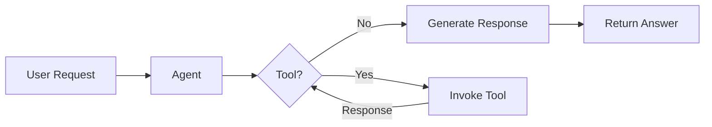
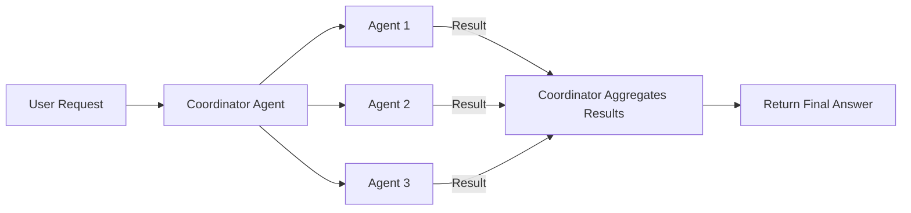
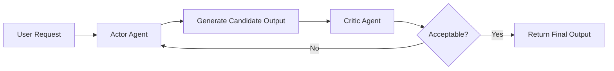
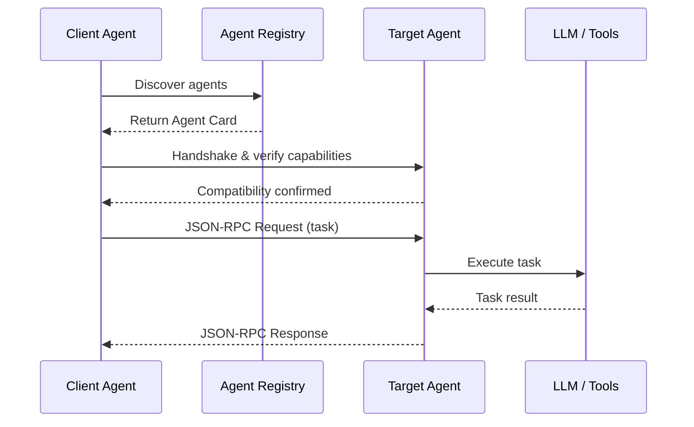
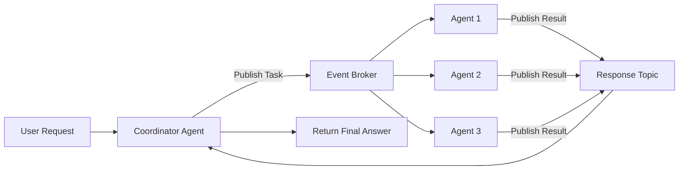

# Chapter 8. From One Agent to Many

Most agentic systems start with a single agent, but increasing tools and problem complexity often require a multiagent architecture. Dividing responsibilities across specialized agents improves performance, reliability, and maintainability. This approach mirrors traditional software engineering practices where large systems evolve from monoliths into modular services. Breaking functionality into smaller agents allows independent development, testing, and reuse of components. As systems grow, effective organization and coordination of multiple agents becomes essential.

---
## How many agents do I need 

### Single-Agent System

Single-agent systems are ideal for tasks with limited complexity, small toolsets, and environments that require minimal coordination. They are often preferred when low latency is important, since multiagent systems introduce additional communication overhead. 

In this architecture, a single agent manages the workflow, deciding when to invoke tools and when to respond to the user. Teams typically begin with a single-agent design and only transition to multiagent systems when task complexity or coordination requirements grow beyond what one agent can effectively handle.

Refer to [this code](https://github.com/michaelalbada/BuildingApplicationsWithAIAgents/blob/main/src/frameworks/langgraph_agents/supply_chain/supply_chain_logistics_agent.py) for implementation. 

#### Example Architecture 

#### Limitations of Single-Agent Systems

- Scalability limits: Single-agent systems struggle as the number of tools grows, making tool selection and prompt management increasingly difficult.

- Performance issues: Large prompts and expanded decision spaces can lead to tool-selection errors and reduced reasoning efficiency.

- Transition to multiagent systems: When tasks span multiple domains or require specialized reasoning, decomposing the system into multiple agents becomes more effective.

---

### Multiagent Systems

Multiagent systems use multiple specialized agents to collaborate on complex tasks that require diverse tools, parallel processing, or domain expertise. By distributing responsibilities across agents, the system improves efficiency and overcomes the scalability limitations of single-agent architectures.

Refer to [this code](https://github.com/michaelalbada/BuildingApplicationsWithAIAgents/blob/main/src/frameworks/langgraph_agents/supply_chain/supply_chain_logistics_multi_agent.py) for implementation. 

#### Example Architecture

#### Benefits of Multiagent Systems

Adaptability and dynamic routing: Multiagent systems can dynamically route tasks to specialized agents based on changing conditions, enabling parallel work, better resource allocation, and improved resilience.

Efficiency in complex environments: By coordinating specialized agents, the system can adapt to real-time data and handle complex, unpredictable scenarios more effectively than single-agent approaches.

#### Challenges of Multiagent Systems

Added complexity and coordination needs: Multiagent systems introduce challenges such as communication overhead, coordination complexity, and potential conflicts between agents, requiring careful design and management.

---

## Principles for Adding Agents

When expanding an agentic system beyond a single-agent architecture, developers should follow several guiding principles that ensure the resulting system remains efficient and manageable.

- Task decomposition: Break complex problems into smaller subtasks so individual agents can focus on specific responsibilities, improving efficiency and reducing overlap.

- Specialization: Assign agents roles aligned with their strengths or domain expertise so the system performs tasks more accurately and effectively.

- Parsimony: Add only the minimum number of agents necessary to achieve the desired functionality to avoid unnecessary complexity and communication overhead.

- Coordination: Establish clear communication and synchronization mechanisms so agents can share information, resolve conflicts, and work together effectively.

- Robustness: Design the system with redundancy and fault tolerance so other agents can continue operations if one agent fails.

- Efficiency: Evaluate the trade-offs between adding more agents and the additional computational and coordination costs they introduce.

---

## Multiagent Coordination Strategies

Different multiagent systems adopt different coordination strategies depending on the nature of the tasks they perform.

- Democratic coordination: All agents participate equally in decision-making and negotiate solutions collectively, which improves fairness but increases communication overhead and decision time.

- Manager-based coordination: A central manager agent assigns tasks and resolves conflicts among agents, simplifying control but potentially creating a bottleneck.

- Hierarchical coordination: Agents are organized in multiple levels where higher-level agents make strategic decisions and lower-level agents execute tasks, balancing centralized and decentralized coordination.

---

## Actor–Critic Agent Patterns

One agent (actor) generates candidate outputs while another (critic) evaluates them against a quality rubric and approves or rejects them. The actor continues producing new candidates until the critic determines the output meets the required quality threshold. This approach improves reliability and output quality through repeated evaluation but increases computational cost due to additional inference cycles.

#### Example Architecture

---

## Communication Techniques

As agent systems evolve from single-agent prototypes to distributed multiagent architectures, communication design becomes critical. Simple approaches like function calls or in-memory message passing work for small setups but break down as systems grow in size, number of agents, or deployment complexity. Scalable systems require communication methods that support coordination, reliability, and distributed execution. Different communication architectures provide trade-offs in latency, scalability, development effort, and operational cost.

### Local Versus Distributed Communication

In small-scale deployments, agents typically communicate using direct function calls, shared memory, or in-memory message queues. These methods are fast and easy to implement but tightly couple components and limit scalability. When agents are deployed across services, containers, or machines, communication must become explicit, asynchronous, and fault-tolerant.

Frameworks such as AutoGen often use in-memory routing to coordinate agent interactions during development. This works well for experimentation and small prototypes. However, production systems require more robust communication infrastructure to handle distributed execution and state management.

### Agent-to-Agent Protocol

The Agent-to-Agent (A2A) protocol lets AI agents communicate and collaborate across platforms without revealing internal details. Each agent publishes an Agent Card, a JSON file describing its identity, capabilities, inputs/outputs, endpoint, and authentication methods. Other agents can read this card to discover peers and determine if they can collaborate.

Communication starts with discovery via a registry or well-known endpoint, followed by a handshake to check compatibility. Once confirmed, agents exchange JSON-RPC requests and responses to perform tasks, such as summarizing text, in a structured and interoperable way.

A2A enables a modular ecosystem where agents act like specialized services, dynamically cooperating to solve complex problems. While still evolving, it provides a foundation for scalable, multi-agent systems.

### Example Architecture
 

---

## Message Brokers and Event Buses

As multiagent systems grow, direct point-to-point communication between agents becomes difficult to manage. Each new connection increases coupling between components, making systems fragile and harder to scale. Message brokers and event buses address this problem by introducing a shared communication layer where agents publish and consume messages asynchronously.

In this architecture, agents do not communicate directly with one another. Instead, they publish events to a broker, and other agents subscribe to topics relevant to their responsibilities. This design decouples producers from consumers, allowing agents to scale independently and enabling new components to be added without modifying existing communication paths.

Several messaging platforms are commonly used in distributed agent systems:

- Apache Kafka: A distributed event-streaming platform designed for high-throughput messaging with durable logs, parallel processing through partitions, and coordinated consumption using consumer groups.

- Redis Streams and RabbitMQ: Lightweight messaging systems that provide fast queues and reliable routing, making them suitable for simpler or moderate-scale distributed applications.

- NATS: A cloud-native messaging system focused on low-latency communication, supporting publish–subscribe and request–reply patterns with optional durable streams via JetStream.

### Advantages 

- Loose coupling between agents - enabling independent deployment and scaling.  
- Asynchronous processing -  allowing agents to handle tasks without blocking one another.  
- Durable logging and replay - enabling recovery from failures or missed events.  
- Observability -  since all interactions pass through the messaging infrastructure.

However, they also introduce architectural complexity. Developers must manage message formats, ensure idempotent processing, and handle eventual consistency between distributed components. Debugging workflows can also become more challenging because interactions occur indirectly through event streams rather than direct function calls.

Despite these challenges, event-driven architectures are widely adopted for large-scale agent systems because they provide a flexible communication fabric capable of supporting thousands of agents interacting concurrently.

Refer to [this code](https://github.com/michaelalbada/BuildingApplicationsWithAIAgents/blob/main/src/frameworks/langgraph_agents/supply_chain/redis_streams_multi_agent_supply_chain.py) for more details. 

---

### Example Architecture
 

## Orchestration and Workflow Engines

Workflow orchestration engines manage the sequencing, dependencies, retries, and failure handling of tasks across agents in complex systems. They provide a higher-level coordination layer that ensures long-running or multistep workflows remain reliable by persisting state and automatically recovering from failures.

These tools are particularly valuable in production environments where processes involve external dependencies, asynchronous operations, or extended execution times. By maintaining durable state and preventing redundant work after failures, orchestration engines enable agent systems to scale from simple prototypes to resilient, real-world deployments.

- Temporal provides durable, stateful workflows with built-in retries and failure recovery, making it suitable for coordinating long-running multiagent tasks. 

- Apache Airflow orchestrates workflows using DAGs and is commonly used for scheduled or batch pipelines in data engineering environments. 

- Dagger enables workflows to be defined as code using containers and automated caching, supporting consistent execution across development, CI/CD pipelines, and production systems.

---

## Managing State and Persistence

Communication infrastructure alone is not sufficient for multiagent systems. Agents must also manage shared state, persistent memory, and task metadata across multiple executions. Designing reliable persistence strategies is therefore a critical architectural concern.

Several storage approaches are commonly used in agent systems:

### Durable Storage Options

| Approach | Pros | Cons | Best for |
|---|---|---|---|
| Relational databases (e.g., PostgreSQL, Redis) | Flexible, queryable, cost-effective | Manual management, potential inconsistency | Custom, high-query systems |
| Vector stores (e.g., Pinecone) | Semantic search, scalable embeddings | Higher cost, specialized setup | Knowledge-intensive agents |
| Object storage (e.g., S3) | Cheap, durable for large data | Slow access, no native indexing | Archival outputs |
| Stateful orchestration frameworks | Automated recovery, low boilerplate | Framework lock-in | Resilient, long-running workflows |

### Stateful Framework Persistence

Some frameworks integrate persistence directly into their execution model. Workflow engines and virtual actor systems automatically checkpoint state and recover execution progress after failures. This reduces developer effort but may introduce framework lock-in.

Different types of memory benefit from different storage strategies:

- **Episodic memory** refers to short-lived task context that may only need temporary storage.  
- **Semantic memory** represents long-term knowledge and typically requires persistent, searchable storage.  
- **Workflow durability** involves preserving system progress during long-running operations and is best handled by workflow engines or actor-based frameworks.

Selecting a persistence strategy involves balancing flexibility, performance, operational complexity, and durability requirements.

---

## Conclusion

Multiagent systems improve the ability to solve complex tasks by enabling task decomposition, parallel execution, and adaptability. However, increasing the number of agents introduces coordination and scalability challenges. Developers must carefully decide how tasks are divided and how agents collaborate. Coordination strategies such as democratic, manager-based, hierarchical, actor–critic, and automated design provide different trade-offs in efficiency and robustness.

Communication infrastructure is essential for scaling multiagent systems. Simple prototypes may use single-container deployments with in-memory communication. Production systems often rely on message brokers, actor frameworks, or workflow engines for reliable messaging and execution. These tools enable scalable communication, state management, and failure recovery in distributed environments.