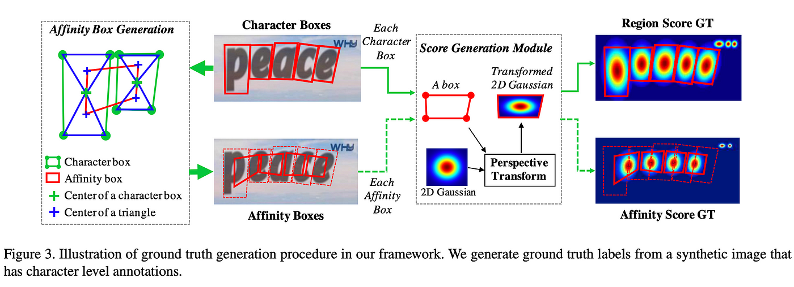

# CRAFT 

CRAFT Architecture for Text Detection
Overview
The CRAFT architecture is designed for precise text detection in images, with a specific focus on handling curved or irregularly shaped text. It employs a combination of a VGG-16 backbone, Feature Pyramid Network (FPN), and Text-Attentional Refinement Network (TARNet) to achieve accurate and detailed text region localization.

Components

1. Backbone Network
CRAFT uses a VGG-16 architecture as its backbone network. This well-established architecture is known for its effectiveness in computer vision tasks.

2. Feature Pyramid Network (FPN)
FPN is integrated to enhance the model's ability to detect text at various scales, crucial for handling text of different sizes within an image.

3. Text-Attentional Refinement Network (TARNet)
TARNet refines initial predictions using pixel-wise binary classification and an attentional mechanism. It aids in improving the accuracy of text region boundaries.

4. Bounding Box Prediction
CRAFT predicts text regions at the pixel level, providing detailed information about the vertices of each text instance. Instead of predicting rectangular bounding boxes, it predicts the four vertices.

5. Loss Function
The loss function combines pixel-wise binary classification loss and regression loss for vertex prediction. This dual-loss structure optimizes the model for accurate text localization.

6. Post-processing (Quad-NMS)
A Quad-NMS post-processing step is applied to eliminate redundant or overlapping predictions. It helps enhance the precision of text detection by suppressing non-maximum predictions.

7. Training Data
CRAFT is trained on datasets with annotated text regions. The training process involves optimizing the model's parameters based on a combination of binary classification loss and regression loss.

8. Usage
Once trained, CRAFT can be employed for text detection in various applications, including document analysis, scene text recognition, and image-based information retrieval.
