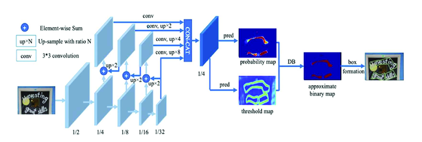
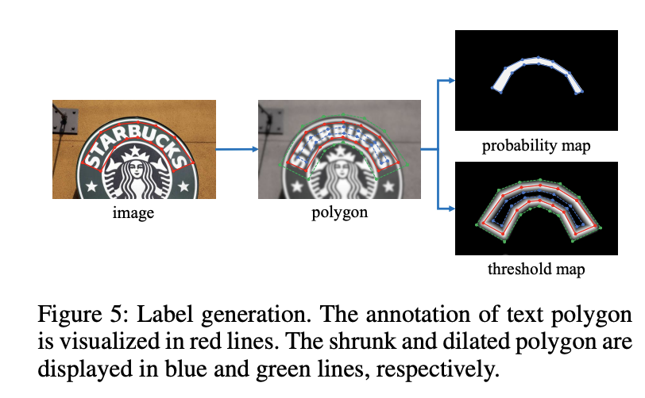

# DBNet 

### Introduction 

Differentiable Binarization is an architecture used for text detection, particularly in the context of scene text recognition. It aims to address the challenges of accurately segmenting text regions from complex backgrounds in images.

The architecture leverages a differentiable thresholding operation that allows for end-to-end training and gradient-based optimization. Traditional binarization methods use fixed thresholding techniques, which can be sensitive to variations in lighting, contrast, and background complexity. In contrast, the differentiable binarization architecture enables the model to learn an adaptive thresholding function during the training process.

The key components of the differentiable binarization architecture include:

### Backbone 

The backbone network is typically a convolutional neural network (CNN) that processes the input image and learns high-level feature representations. It extracts hierarchical features from the image, capturing both local and global information.

### Binarization Module

Binarization module takes the feature maps generated by the backbone network and applies a sigmoid activation function to obtain a pixel-wise probability map. This probability map represents the probability of each pixel being part of a text region.

Given a probability map \( P \in R^{H×W} \) produced by a backbone network, it is essential to convert it to a binary map \( P \in R^{H×W} \), where pixels with value 1 is considered as valid text areas. 

### Differentiable Thresholding

Standard binarization module is not differentiable. So it cannot be optimized with along with the segmentation network during training. To solve this problem differentiable binarization was proposed. 

Differentiable binarization with adaptive thresholds can not only help differentiate text regions from the background, but also separate text instances which are closely aligned. 

Unlike traditional binarization methods that use a fixed threshold value to convert the probability map into a binary mask, differentiable binarization employs a differentiable thresholding operation. This operation uses a learned parameter to dynamically adjust the threshold during training. It allows the model to optimize the threshold value based on the loss function and backpropagate gradients through the thresholding process.

### Adaptive Threshold 

The threshold map would highlight the text border region even without supervision for the threshold map. This indicates that the border-like threshold
map is beneficial to the final results. Thus, we apply borderlike supervision on the threshold map for better guidance.

### Loss Function

During training, the differentiable binarization architecture is optimized end-to-end by jointly learning the parameters of the backbone network and the binarization module. The gradients are backpropagated through the entire architecture, allowing the model to adaptively binarize the text regions in an image.

The loss function L can be expressed as a weighted sum of
the loss for the probability map \( L_s\), the loss for the binary
map \( L_b\), and the loss for the threshold map \( L_t\)

$$ L = L_s + α × L_b + β ×  L_t$$

\( \alpha\) and \( \beta \) are set to 1.0 and 10 respectively. Binary cross entropy is applied for both \( L_s\) and \( L_b\). To overcome the unbalance of the number of positives and negatives, hard negative mining is used in the BCE
loss by sampling the hard negatives. 

In the inference period, we can either use the probability
map or the approximate binary map to generate text bounding boxes, which produces almost the same results.

### Box formation 

- probability map is firstly binarized with a constant threshold (0.2), to get the binary map
- the connected regions (shrunk text regions) are obtained from the binary map
- the shrunk regions are dilated with an offset \( D^{'}\)

