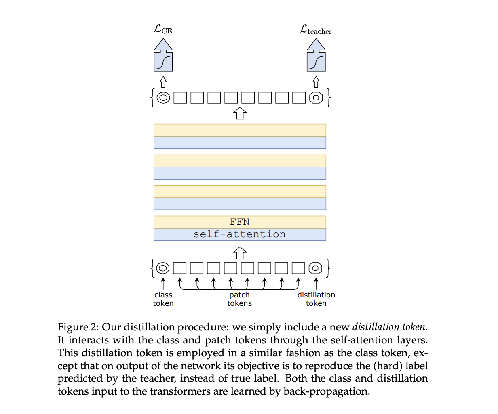

The Data-efficient Image Transformer (DeiT) is a transformer-based architecture designed for image classification tasks. Introduced to address the challenge of achieving strong performance with limited labeled data, DeiT leverages distillation techniques and large-scale unlabeled datasets during training. Below is a simplified overview of the DeiT transformer architecture:

### **Encoder**

The encoder in the Transformer architecture is responsible for processing the input sequence, extracting relevant features, and creating a rich representation that can be used for downstream tasks such as classification or generation. The encoder consists of a stack of identical layers, each comprising two main sub-components: the self-attention mechanism and position-wise feedforward networks.

Similar to other vision transformers, DeiT starts by dividing the input image into non-overlapping patches, which are linearly embedded to obtain a sequence of vectors. This process allows the model to process images as sequences of patches, making it compatible with the transformer architecture.
	
### **Distillation** 

Distillation through attention, often referred to as attention distillation, is a technique used in machine learning to transfer knowledge from a larger, more complex model (teacher) to a smaller, simpler model (student). The primary goal is to improve the efficiency and computational performance of the smaller model while retaining its ability to make accurate predictions. This technique is particularly useful when deploying models to resource-constrained environments or edge devices.

The attention mechanism in a transformer model plays a crucial role in capturing relationships between different parts of the input sequence. In attention distillation, the teacher model has a more sophisticated attention mechanism, and the goal is to transfer this knowledge to the student model's attention mechanism.

Here's a simplified explanation of attention distillation:

1. **Teacher Model:** The teacher model is a larger and more complex model, often pre-trained on a large dataset. It has a highly expressive attention mechanism that allows it to capture intricate patterns and dependencies in the data.
    
2. **Student Model:** The student model is a smaller and more computationally efficient model that aims to replicate the performance of the teacher model. However, due to its reduced size, it may not capture the same level of complexity.
    
3. **Distillation Process:**
    
    - **Soft Labels:** During training, instead of using hard labels (one-hot encoded vectors) for the ground truth, soft labels are generated based on the teacher model's predictions. Soft labels represent the probability distribution over classes for each input example.
    - **Attention Maps:** Additionally, attention maps, which represent the distribution of attention weights assigned to different parts of the input sequence by the teacher model, are computed.
    - **Loss Function:** The loss function for training the student model is a combination of the standard classification loss (e.g., cross-entropy loss) using soft labels and a distillation loss based on the attention maps. The distillation loss encourages the student model to mimic the attention patterns of the teacher model.
4. **Training Objective:** The overall training objective is a weighted sum of the classification loss and the distillation loss. The distillation loss ensures that the student model not only predicts similar probabilities as the teacher model but also learns similar attention patterns.
    
5. **Inference:** Once trained, the student model can be used for inference on new data. While it may have a smaller number of parameters, it benefits from the distilled knowledge of the teacher model, leading to improved generalization performance.
    



    
### **Data Augmentation and Training Strategies**

 DeiT benefits from extensive data augmentation techniques during training, helping the model learn robust features from diverse visual perspectives. Additionally, training on a large-scale dataset without labels aids the model in learning generic representations, contributing to its ability to perform well with smaller labeled datasets.

Compared to models that integrate more priors (such as convolutions), transformers require a larger amount of data. Thus, in order to train with datasets of the same size, we rely on extensive data augmentation. We evaluate different types of strong data augmentation, with the objective to reach a data-efficient training regime.

### ** Sample Code**
``` py
import torch
import torch.nn as nn
import torchvision.transforms as transforms
from torchvision import models

class DistillationHead(nn.Module):
    def __init__(self, in_features, num_classes):
        super(DistillationHead, self).__init__()
        self.fc = nn.Linear(in_features, num_classes)

    def forward(self, x):
        return self.fc(x)

class DeiTModel(nn.Module):
    def __init__(self, model_name, num_classes, pretrained_teacher=None):
        super(DeiTModel, self).__init__()

        # Load pre-trained teacher model for distillation if provided
        if pretrained_teacher is not None:
            self.teacher = models.__dict__[pretrained_teacher](pretrained=True)
            self.teacher_head = DistillationHead(self.teacher.fc.in_features, num_classes)
        else:
            self.teacher = None
            self.teacher_head = None

        # Load DeiT architecture
        self.deit = models.vit_deit_small_patch16_224(pretrained=True)  # Example patch-size and image-size

        # Classification head for DeiT
        self.head = DistillationHead(self.deit.head.in_features, num_classes)

    def forward(self, x):
        # Forward pass through DeiT model
        deit_features = self.deit(x)

        # Forward pass through teacher model for distillation
        if self.teacher is not None:
            with torch.no_grad():
                teacher_features = self.teacher(x)
            teacher_logits = self.teacher_head(teacher_features)

        # Forward pass through DeiT's classification head
        deit_logits = self.head(deit_features)

        if self.teacher is not None:
            return deit_logits, teacher_logits
        else:
            return deit_logits

# Example usage
num_classes = 1000
model = DeiTModel(model_name='vit_deit_small_patch16_224', num_classes=num_classes)

```

### **Conclusion**

The use of distillation and efficient training strategies allows DeiT to achieve strong performance with fewer labeled examples compared to some traditional convolutional neural network architectures. It highlights the potential of leveraging unsupervised learning and knowledge transfer in improving the data efficiency of deep learning models for image classification tasks. Keep in mind that the specifics of the architecture may vary, and for a detailed understanding, it's recommended to refer to the official research paper or code documentation.