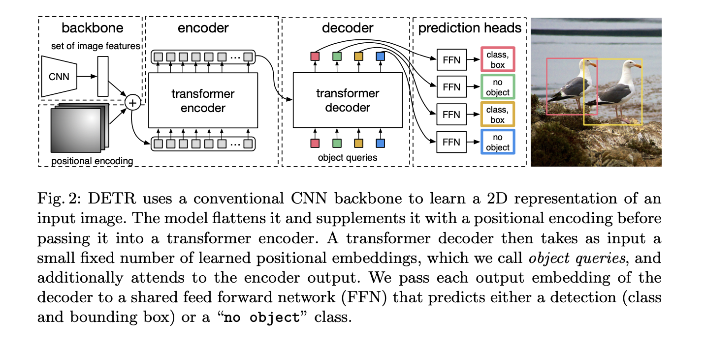

# Detection Transformer 

Detection Transformer (DeTR) is a state-of-the-art object detection model that uses transformer architecture to directly predict object bounding boxes and categories in a single feedforward pass. The model was proposed in a paper titled "End-to-End Object Detection with Transformers" by Nicolas Carion et al. DeTR matches the performance of state-of-the-art methods  such as the Faster R-CNN baseline on the challenging COCO object detection dataset. 

## Architecture 

DeTR consists of two main components: a backbone network that encodes the input image and a transformer network that performs the object detection. Here's an overview of the DeTR architecture:



###  CNN Backbone 

Convolutional neural network (CNN) encodes the input image into a sequence of feature maps. These feature maps are passed through a set of convolutional layers that gradually reduce the spatial resolution and increase the number of channels. Detr uses ResNet model that is pretrained on Imagenet. 


### Encoder 

- \(1x1\) convolution is used to reduce the channel dimension of the high-level activation map f from C to a smaller dimension d.
- Since encoder expects sequence as in input, we collapse the spatial dimensions of \(z_0\) into one dimension, resulting in a d×HW feature map. 
- Each encoder layer has a standard architecture and consists of a multi-head self-attention module and a feed forward network (FFN). 
- Encoder outputs a set of learned features that are used to predict the bounding boxes and categories of the objects in the image.


### Decoder 

- Decoder follows the standard architecture of the transformer, transforming N embeddings of size d using multi-headed self- and encoder-decoder attention mechanisms.
- Detr decodes the N objects in parallel at each decoder layer in contrast to standard transformers. 
- These input embeddings are learnt positional encodings that we refer to as object queries. These are transformed into an output embedding by the decoder.
- Output embeddings are then independently decoded into box coordinates and class labels by a feed forward network resulting N final Predictions. 

### Positional Encoding 
In order to incorporate spatial information into the transformer architecture, positional encodings are added to the learned features. The positional encodings are learned during training and encode the spatial information of the features.

### Object Queries 

The transformer network uses object queries to attend to specific regions in the feature maps and predict the corresponding bounding boxes and categories. The object queries are learnable embeddings that are passed through the transformer encoder along with the learned features.


### Prediction Heads

The transformer network outputs a set of predictions for each object query. The predictions include the predicted class probability distribution, the predicted bounding box coordinates, and a binary indicator for whether an object is present or not.

### FFN 

- Final prediction is computed by a 3-layer perceptron with ReLU activation function and hidden dimension d and a linear projection layer. 
- FFN predicts the normalized center coordinates, height and width of the box w.r.t. the input image and the linear layer predicts the class label using a softmax function. 
- We predict a fixed-size set of N bounding boxes, where N is usually much larger than the actual number of objects of interest in an image. 
- \(\phi\) is used to represent no object in an image (similar to background in object detection). 

## Training Hyperparameters

- DeTR with AdamW setting the initial transformer’s learning rate to \(10^{-4}\) , the backbone’s to \(10^{-5}\) , and weight decay to \(10^{-4}\).
- scale augmentation - resizing the input images such that the shortest side is at least 480 and at most 800 pixels while the longest at most 1333. 
- random crop augmentations during training, improving the per- formance by approximately 1 AP
- We use linear combination of l1 and GIoU losses for bounding box regression with \(\lambda_{L1}\) = 5 and \(\lambda_{giou}\) = 2 weights respectively. All models were trained with N = 100 decoder query slots. 
- All losses are normalized by the number of objects inside the batch. 


## Loss Function 

- Loss function used during training is a combination of the binary cross-entropy loss for object presence, the smoothed L1 loss for bounding box regression, and the cross-entropy loss for classification. 
- Detr loss produces an optimal bipartite matching between predicted and ground truth objects, and then optimize object-specific (bounding box) losses. This is computed as follows

	- computes an assignment between the targets and the predictions of the network
	- Compute the classification cost
	- Compute the L1 cost between boxes
	- Compute the giou cost betwen boxes
	- Final cost matrix =  \(cost_{cls}\) + \(cost_{l1}\) + \(cost_{giou}\)


- l1 loss will have different scales for small and large boxes even if their relative errors are similar. To mitigate this issue detr use a linear combination of the l1 loss and the generalized IoU loss. 


## Sample Code

``` py 
import torch
import torch.nn as nn
import torch.nn.functional as F
from torchvision.models import resnet50
from torch.nn import TransformerEncoder, TransformerDecoder

class DETR(nn.Module):
    def __init__(self, num_classes, num_queries):
        super(DETR, self).__init__()
        # CNN backbone
        self.backbone = resnet50(pretrained=True)
        del self.backbone.fc  # remove the fully connected layer
        
        # Transformer encoder
        self.transformer_encoder = TransformerEncoder(...)
        
        # Transformer decoder
        self.transformer_decoder = TransformerDecoder(...)
        
        # Final layers for class prediction and bounding box prediction
        self.class_pred = nn.Linear(...)
        self.bbox_pred = nn.Linear(...)
        
        # Number of object queries
        self.num_queries = num_queries
        
    def forward(self, x):
        # CNN backbone
        features = self.backbone(x)
        
        # Transformer encoder
        enc_outputs = self.transformer_encoder(features)
        
        # Initialize object queries
        tgt = torch.zeros(self.num_queries, features.shape[0], features.shape[1])
        
        # Transformer decoder
        dec_outputs = self.transformer_decoder(tgt, enc_outputs)
        
        # Final predictions
        class_logits = self.class_pred(dec_outputs)
        bbox_pred = self.bbox_pred(dec_outputs)
        
        return class_logits, bbox_pred

# Example usage:
# Initialize DETR model
num_classes = 80  # COCO dataset has 80 object classes
num_queries = 100  # Number of object queries
model = DETR(num_classes, num_queries)

# Forward pass
input_image = torch.randn(1, 3, 224, 224)  # Example input image
class_logits, bbox_pred = model(input_image)

# Output shapes: class_logits.shape = (num_queries, num_classes), bbox_pred.shape = (num_queries, 4)

```
## Conclusion 

Overall, DeTR is a powerful object detection model that combines the strengths of both convolutional neural networks and transformer networks. By directly predicting the object bounding boxes and categories, DeTR eliminates the need for anchor boxes and achieves state-of-the-art performance on several object detection benchmarks.


## References

1. [End-to-End Object Detection with Transformers](https://arxiv.org/pdf/2005.12872.pdf)
2. [Detection Transformer](https://github.com/facebookresearch/detr)


