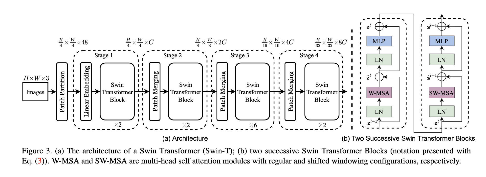
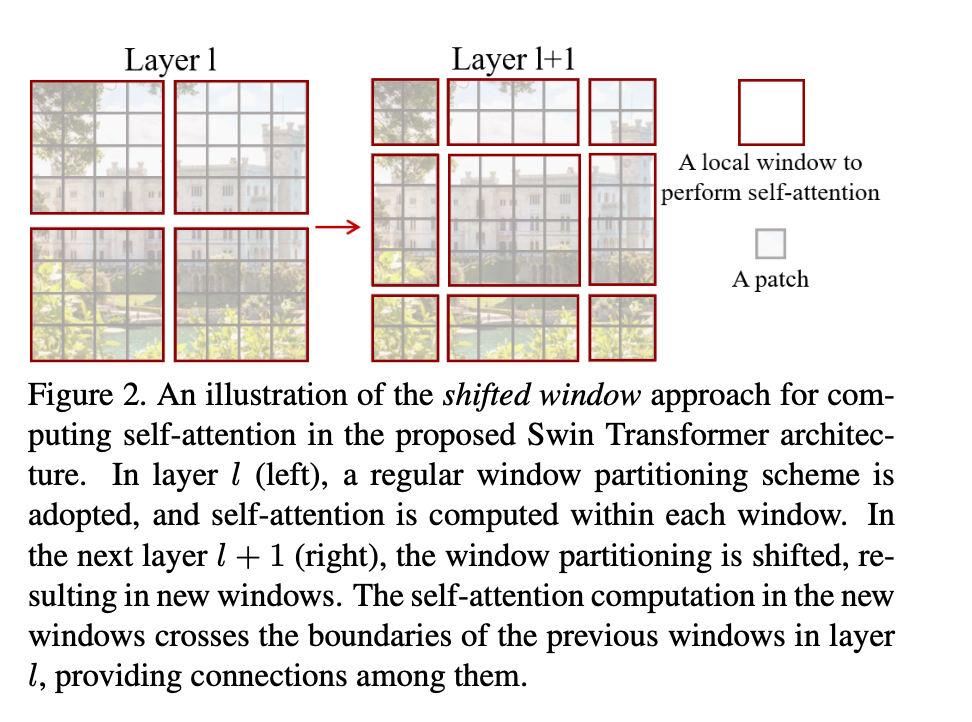

# Swin Transformer 

## Introduction 

Swin Transformer is a recently proposed transformer architecture for image classification tasks. The model was proposed in a paper titled "Swin Transformer: Hierarchical Vision Transformer using Shifted Windows" by Ze Liu et al. Swin Transformer introduces a novel hierarchical architecture that divides the input image into a hierarchy of windows and processes them using a series of transformer blocks. Here's an overview of the Swin Transformer architecture:

## Architecture 

### Patch Embeddings 

First step in Swin Transformer is same as vision transformer. Convert an image into fixed patches of patch size 4x4. Then each patch is linearly embedded using a linear projection layer. This can be done using convolution 2d using kernel size and stride 4.  maps each window to a vector representation using a learnable embedding layer. The embeddings are then passed through a series of transformer blocks, which perform multi-head self-attention and feedforward operations.

### Patch Merging 

The first patch merging layer concatenates the features of each group of 2×2 neighboring patches, and applies a linear layer on the 4C - dimensional concatenated features. This reduces the number of tokens by a multiple of 2×2 = 4 (2× downsampling of resolution) and the output dimension is set to 2C. The number of tokens is reduced by patch merging layers as the network gets deeper. 

### Shifted Window Attention

At every stage in swin transformer, there are sequence of swin transformer blocks in tandem. Multi attention in  Standard transformer block is replaced using Shifted window self attention followed by 2 layered MLP and GELU. A LayerNorm (LN) layer is applied before each MSA module and each MLP, and a residual connection is applied after each module. 

The global computation leads to quadratic complexity with respect to the number of tokens, making it unsuitable for many vision problems. For efficient modeling, we propose to compute self-attention within local windows. The windows are arranged to evenly partition the image in a non-overlapping manner.

The window-based self-attention module lacks connections across windows, which limits its modeling power. To introduce cross-window connections while maintaining the efficient computation of non-overlapping windows, we propose a shifted window partitioning approach which alternates between two partitioning configurations in consecutive Swin Transformer blocks.

In first module feature map is evenly divided into small patches with local self attention. In second layer we displace the windows by (M/2, M/2) pixels from the regularly partitioned windows, and perform attention between these new windows. This leads to cross-window connections. 

### Classification Head

Swin Transformer uses a simple linear layer to map the output embeddings to a set of class probabilities. The model is trained using a cross-entropy loss function, which measures the difference between the predicted probabilities and the true labels.
<h2 id="conclusion">Conclusion</h2>

## Conclusion 

Overall, Swin Transformer is a powerful transformer architecture for image classification tasks that uses a novel hierarchical processing strategy and shifted windows to capture both local and global features. The model achieves state-of-the-art performance on several benchmark datasets, including ImageNet and COCO.

