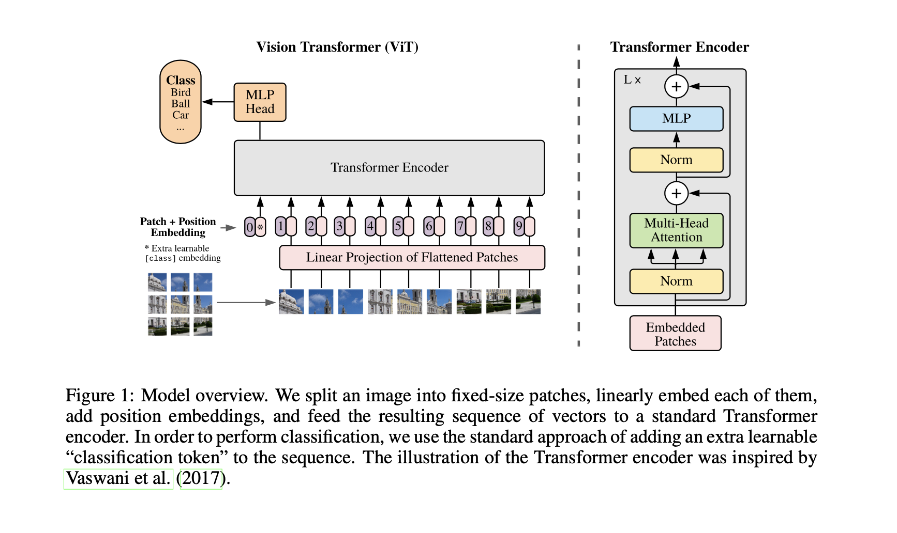

# Vision Transformer

## Introduction 

The Vision Transformer (ViT) is a deep learning architecture introduced in the paper "An Image is Worth 16x16 Words: Transformers for Image Recognition" by Alexey Dosovitskiy et al. The Vision Transformer applies the transformer architecture, originally designed for natural language processing tasks, to computer vision tasks such as image classification. Here's a detailed explanation of the key components and concepts of the Vision Transformer:

## Architecture 





1. **Image Patching:**
    - The first step in the Vision Transformer is to break the input image into fixed-size non-overlapping patches. Each patch is treated as a token, and these patches are linearly embedded to obtain a sequence of vectors.
2. **Patch Embedding:**
    - A small convolutional neural network (CNN) is used as the patch embedding layer to convert each image patch into a fixed-size vector. This vector is then considered as the embedding for the corresponding image patch.
3. **Positional Embeddings:**
    - Similar to the original Transformer model, ViT uses positional embeddings to provide information about the spatial arrangement of tokens. These embeddings are added to the patch embeddings, allowing the model to understand the spatial relationships between different parts of the image.
4. **Transformer Encoder:**
    - The core of the Vision Transformer is the transformer encoder. It consists of multiple layers, each containing self-attention and feedforward sub-layers. The self-attention mechanism enables the model to capture global dependencies between patches, allowing it to consider the entire image context during classification.
5. **Classification Token:**
    - To perform classification, a special learnable token (CLS token) is prepended to the sequence of patch embeddings. The output of this token, after passing through the transformer layers, is used for making predictions. This design choice enables the model to capture global information for image classification.
6. **Global Average Pooling:**
    - Instead of relying on fully connected layers at the end of the network, ViT typically uses global average pooling after the transformer layers. This helps in reducing the number of parameters and promotes better generalization.

### **Training**


ViT models are usually pre-trained on large datasets using a proxy task, such as image classification on a diverse set of images. The pre-trained model can then be fine-tuned on specific downstream tasks with smaller datasets.

ViT can be pretrained with a masked patch prediction for self-supervision that is similar to masked language modeling in BERT. Refer <a href="https://analyticsindiamag.com/an-illustrative-guide-to-masked-image-modelling/">this</a> for more information on Masked Image Modeling. By pretraining on a large unlabeled dataset, the ViT can learn to generalize to a wide range of visual concepts and achieve better performance on tasks with limited labeled data.

### Advantages 

The ViT architecture has been shown to achieve state-of-the-art performance on a range of image recognition tasks.  ViT has the advantage of being able to process images of arbitrary size, as it can be trained on images of different resolutions. ViT has the ability to handle long-range dependencies between different parts of an image. Additionally, ViT can be trained on large-scale datasets using self-supervised learning, which does not require expensive manual annotations.

ViT demonstrates that the inductive biases introduced by CNNs are useful for small datasets, but not for larger ones. Experiments demonstrated that hard-coding the two-dimensional structure of the image patches into the positional encodings does not improve quality. 


### **Sample Code**

``` py 
import torch
import torch.nn as nn
import torchvision.transforms as transforms
from torch.utils.data import DataLoader
from torchvision.datasets import CIFAR10
from einops import rearrange

# Vision Transformer Model
class VisionTransformer(nn.Module):
    def __init__(self, img_size=32, patch_size=4, in_channels=3, num_classes=10, embed_dim=256, num_heads=8, num_layers=6):
        super(VisionTransformer, self).__init__()
        self.patch_embed = nn.Conv2d(in_channels, embed_dim, kernel_size=patch_size, stride=patch_size)
        num_patches = (img_size // patch_size) ** 2
        self.cls_token = nn.Parameter(torch.randn(1, 1, embed_dim))
        self.pos_embed = nn.Parameter(torch.randn(1, num_patches + 1, embed_dim))
        self.transformer = nn.Transformer(
            d_model=embed_dim,
            nhead=num_heads,
            num_encoder_layers=num_layers
        )
        self.fc = nn.Linear(embed_dim, num_classes)

    def forward(self, x):
        x = self.patch_embed(x)
        x = rearrange(x, 'b c h w -> b (h w) c')
        cls_tokens = self.cls_token.expand(x.shape[0], -1, -1)
        x = torch.cat([cls_tokens, x], dim=1)
        x = x + self.pos_embed
        x = self.transformer(x)
        x = x.mean(dim=1)  # Global average pooling
        x = self.fc(x)
        return x

# Data loading and preprocessing
transform = transforms.Compose([
    transforms.ToTensor(),
    transforms.Resize((32, 32)),  # Adjust the size according to the model architecture
])

train_dataset = CIFAR10(root='./data', train=True, download=True, transform=transform)
train_loader = DataLoader(train_dataset, batch_size=64, shuffle=True, num_workers=4)

# Initialize and train the model
device = torch.device('cuda' if torch.cuda.is_available() else 'cpu')
model = VisionTransformer().to(device)
criterion = nn.CrossEntropyLoss()
optimizer = torch.optim.Adam(model.parameters(), lr=0.001)

# Training loop
num_epochs = 5
for epoch in range(num_epochs):
    for images, labels in train_loader:
        images, labels = images.to(device), labels.to(device)

        # Forward pass
        outputs = model(images)
        loss = criterion(outputs, labels)

        # Backward pass and optimization
        optimizer.zero_grad()
        loss.backward()
        optimizer.step()

    print(f'Epoch [{epoch + 1}/{num_epochs}], Loss: {loss.item():.4f}')

# Note: This is a basic example, and for real-world scenarios, you might need to fine-tune the architecture and training parameters.

```
## Conclusion 

In summary, the Vision Transformer is a groundbreaking architecture that applies the transformer model to image classification tasks. By representing images as sequences of tokens and leveraging self-attention mechanisms, ViT demonstrates competitive performance compared to traditional CNNs, especially on tasks involving complex visual relationships and large-scale datasets. 


## References 

- [AN IMAGE IS WORTH 16X16 WORDS](https://arxiv.org/pdf/2010.11929.pdf])
- [Vision Transformer](https://amaarora.github.io/posts/2021-01-18-ViT.html)
- [An Illustrative Guide to Masked Image Modelling](https://analyticsindiamag.com/an-illustrative-guide-to-masked-image-modelling/)


