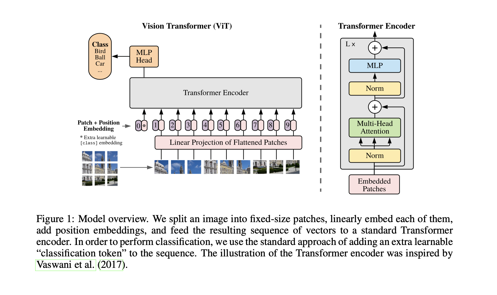

# Vision Transformer

## Introduction 

Transformer architecture has become the de-facto standard for natural language processing tasks. Vision Transformer (ViT) is one of the first attempts to use transformer architecture for computer vision tasks. 

## Architecture 

Split the original image into multiple patches of patch size 16x16. Then these patches are passed through a linear layer to get d (768) dimensional representation for each patch. This linear layer can be a simple convolution layer with kernel, stride as patch size i.e 16 and output channels as d (768). These representations are also known as patch embeddings. If we consider an image resolution of 224 x 224 then patch embedding matrix would be of shape (196 x 768).

Similar to BERT, we add the \(&lt;cls&gt;\) token to this patch embedding matrix. Then positional encoding is added to the patch embedding matrix. These combined embeddings of shape \(197x768\) are passed to the transformer encoder. 

There are 12 transformer encoder layers in ViT-Base architecture. In each transformer encoder layer inputs are fed to layernorm followed by MultiHeadAttention layer. MLP block consists of two linear layers and a GELU non-linearity. The outputs from the MLP block are again added to the inputs (skip connection) to get the final output from one layer of the Transformer Encoder.

After processing the image patches through the Transformer, the learned representation of \(&lt;cls&gt;\) is fed into a classification head to make a prediction about the image class. 

### Advantages 

The ViT architecture has been shown to achieve state-of-the-art performance on a range of image recognition tasks.  ViT has the advantage of being able to process images of arbitrary size, as it can be trained on images of different resolutions. ViT has the ability to handle long-range dependencies between different parts of an image. Additionally, ViT can be trained on large-scale datasets using self-supervised learning, which does not require expensive manual annotations.

ViT demonstrates that the inductive biases introduced by CNNs are useful for small datasets, but not for larger ones. Experiments demonstrated that hard-coding the two-dimensional structure of the image patches into the positional encodings does not improve quality. 

## Training 

### PreTraining 

ViT can be pretrained with a masked patch prediction for self-supervision that is similar to masked language modeling in BERT. Refer <a href="https://analyticsindiamag.com/an-illustrative-guide-to-masked-image-modelling/">this</a> for more information on Masked Image Modeling. By pretraining on a large unlabeled dataset, the ViT can learn to generalize to a wide range of visual concepts and achieve better performance on tasks with limited labeled data.

## Conclusion 

ViT has shown promising results on a wide range of computer vision tasks and has become an active area of research in the computer vision community.

## References 

- [AN IMAGE IS WORTH 16X16 WORDS](https://arxiv.org/pdf/2010.11929.pdf])
- [Vision Transformer](https://amaarora.github.io/posts/2021-01-18-ViT.html)
- [An Illustrative Guide to Masked Image Modelling](https://analyticsindiamag.com/an-illustrative-guide-to-masked-image-modelling/)

